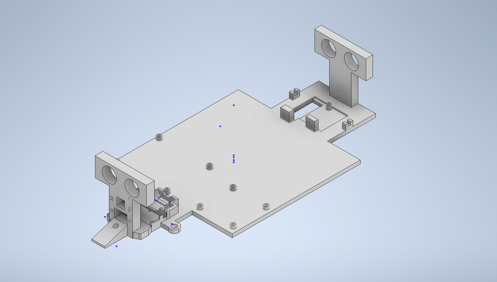
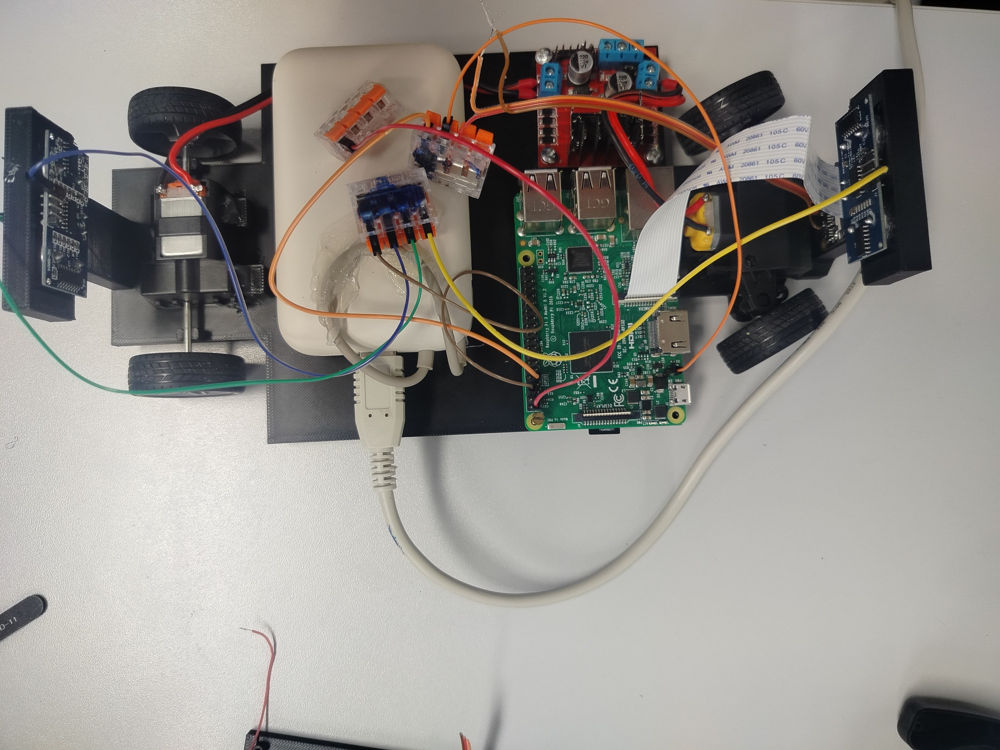

# WRO Future Engineers 2026 — Robot Documentation

<p align="center">
  
</p>

**Team:** TRAKTORISTAK
**Competition:** WRO Future Engineers 2026
**Project Type:** Autonomous vehicle prototype
**Main Controller:** Raspberry Pi 3
**Software Stack:** Python, OpenCV, NumPy, gpiozero, pigpio, Picamera2

This document is the consolidated engineering reference for the WRO 2026 Future
Engineers robot built by team TRAKTORISTAK. It merges the main repository
README with the hardware and software submodule documentation, and reserves a
section for the mechanical design package which is imported separately.

---

## Table of Contents

- [1. Project Overview](#1-project-overview)
- [2. Team Introduction](#2-team-introduction)
- [3. Repository Structure](#3-repository-structure)
- [4. Submodules and Repository Access](#4-submodules-and-repository-access)
- [Part I — Hardware Documentation](#part-i--hardware-documentation)
  - [5. Hardware System Overview](#5-hardware-system-overview)
  - [6. Hardware Architecture](#6-hardware-architecture)
  - [7. Hardware Components](#7-hardware-components)
  - [8. Component Photos](#8-component-photos)
  - [9. Power System](#9-power-system)
  - [10. Controller and Sensors](#10-controller-and-sensors)
  - [11. Camera System](#11-camera-system)
  - [12. Motor Control](#12-motor-control)
  - [13. Wiring Overview](#13-wiring-overview)
  - [14. Schematic](#14-schematic)
- [Part II — Mechanical Documentation](#part-ii--mechanical-documentation)
  - [14a. Design Philosophy](#14a-design-philosophy)
  - [14b. Custom 3D-Printed Parts](#14b-custom-3d-printed-parts)
  - [14c. Drivetrain and Steering Assembly](#14c-drivetrain-and-steering-assembly)
  - [14d. 3D Model and Built Prototype](#14d-3d-model-and-built-prototype)
  - [14e. Mechanical Submodule](#14e-mechanical-submodule)
- [Part III — Software Documentation](#part-iii--software-documentation)
  - [15. Software Overview](#15-software-overview)
  - [16. Requirements](#16-requirements)
  - [17. Quick Start](#17-quick-start)
  - [18. Running the Robot](#18-running-the-robot)
  - [19. Software Project Layout](#19-software-project-layout)
- [Part IV — Software Architecture](#part-iv--software-architecture)
  - [20. Runtime Architecture](#20-runtime-architecture)
  - [21. Runtime Lifecycle](#21-runtime-lifecycle)
  - [22. Race State Machine](#22-race-state-machine)
  - [23. Motion and Motors](#23-motion-and-motors)
  - [24. Sensors and Vision](#24-sensors-and-vision)
  - [25. Utility Modules](#25-utility-modules)
- [Part V — Hardware and Configuration](#part-v--hardware-and-configuration)
  - [26. Configuration Model](#26-configuration-model)
  - [27. Pin Configuration](#27-pin-configuration)
  - [28. Motor and Motion Configuration](#28-motor-and-motion-configuration)
  - [29. Sensor Configuration](#29-sensor-configuration)
  - [30. Race Configuration](#30-race-configuration)
  - [31. Raspberry Pi Runtime Libraries](#31-raspberry-pi-runtime-libraries)
- [Part VI — Deployment](#part-vi--deployment)
  - [32. Deployment Overview](#32-deployment-overview)
  - [33. Configure the Target](#33-configure-the-target)
  - [34. Deploy Files](#34-deploy-files)
  - [35. Run Remotely](#35-run-remotely)
  - [36. Raspberry Pi Setup Expectations](#36-raspberry-pi-setup-expectations)
- [Part VII — Calibration](#part-vii--calibration)
  - [37. Calibration Overview](#37-calibration-overview)
  - [38. Using Calibration Output](#38-using-calibration-output)
  - [39. Generated Calibration Files](#39-generated-calibration-files)
- [Part VIII — Component Tests](#part-viii--component-tests)
  - [40. Hardware Component Tests](#40-hardware-component-tests)
  - [41. Software-Only Component Tests](#41-software-only-component-tests)
- [Part IX — Development Workflow](#part-ix--development-workflow)
  - [42. Validation Workflow](#42-validation-workflow)
  - [43. Formatting and Quality Tools](#43-formatting-and-quality-tools)
- [44. License](#44-license)

---

## 1. Project Overview

This project documents an autonomous vehicle developed for the **WRO Future
Engineers 2026** competition. The robot uses a Raspberry Pi 3 as its central
controller and combines camera-based color recognition, ultrasonic distance
sensing, IR reflectance sensing, encoder feedback, and modular Python control
software to navigate the competition track and avoid obstacles.

The project is split into three engineering areas, each maintained as its own
Git submodule under the main repository:

- **Hardware** (`schemes/`) — controller, power system, sensors, camera, motor
  driver, wiring, and schematic references.
- **Software** (`src/`) — robot runtime, deployment, calibration, component
  tests, architecture, and development workflow.
- **Mechanical** (`models/`) — chassis, drivetrain mounts, sensor mounts, and
  3D-printable assets. Documented in [Part II](#part-ii--mechanical-documentation-placeholder).

The main repository acts as the central entry point. The QR code or main
GitHub repository link should lead to this documentation, from which the
hardware, software, and mechanical submodules can be opened directly.

---

## 2. Team Introduction

<table>
  <tr>
    <td align="center" width="33%">
      <br>
      <strong>MARK GULYAS</strong><br>
      <em>Mechanical Design Support</em><br>
      <sub>Assistance, Part Development, Robot Assembly</sub>
    </td>
    <td align="center" width="33%">
      <br>
      <strong>RICHARD NAGY</strong><br>
      <em>Team Leader, Hardware Designer, Software Developer, Control System Developer</em><br>
      <sub>Robot Control, Hardware Integration, Software Architecture</sub>
    </td>
    <td align="center" width="33%">
      <br>
      <strong>PREDRAG PRIJOVIC</strong><br>
      <em>CAD Design Leader</em><br>
      <sub>CAD Design, Mechanical Engineering, Robot Assembly</sub>
    </td>
  </tr>
</table>

| Team Member | Role | Responsibilities |
| --- | --- | --- |
| **Mark Gulyas** | Mechanical Design Support | Assistance, part development, robot assembly |
| **Richard Nagy** | Team Leader, Hardware Designer, Software Developer, Control System Developer | Robot control, hardware integration, software architecture |
| **Predrag Prijovic** | CAD Design Leader | CAD design, mechanical engineering, robot assembly |

---

## 3. Repository Structure

| Folder | Description |
| --- | --- |
| `t-photos` | Team member photos, official team photo, and informal group pictures |
| `v-photos` | Vehicle images: top, bottom, front, back, left, and right views |
| `video` | `video.md` with a link to the driving demonstration |
| `schemes` | Hardware repository with KiCad schematics, wiring references, component pictures, and generated schematic PDF |
| `src` | Full Python source code repository for robot control components |
| `models` | Mechanical repository for robot design files and 3D-printable assets |
| `other` | Supporting documentation files, logo assets, and repository resources |
| `obstacle challenge & open challenge` | Codebase or references for both competition challenges |

---

## 4. Submodules and Repository Access

This repository uses Git submodules for the main engineering areas. The
folders below are separate repositories connected to this documentation
repository:

| Folder | Repository |
| --- | --- |
| `schemes` | [WRO-Robot-Hardware](https://github.com/Ricsi1231/WRO-Robot-Hardware) — hardware documentation and schematics |
| `src` | [WRO-Robot-Software](https://github.com/Ricsi1231/WRO-Robot-Software) — robot control source code |
| `models` | [WRO-Robot-Mechanical](https://github.com/Ricsi1231/WRO-Robot-Mechanical) — mechanical design files |

When opening the project on GitHub, users can enter these folders directly
from this repository. If a folder appears empty after cloning locally, the
submodules were not downloaded yet.

Initialize submodules after cloning:

```bash
git submodule update --init --recursive
```

For a fresh clone including all submodules:

```bash
git clone --recurse-submodules https://github.com/Ricsi1231/WRO-Robot.git
```

---

# Part I — Hardware Documentation

## 5. Hardware System Overview

The robot is powered by a two-cell 18650 Li-ion battery pack. The battery
voltage is routed into an LM2596 DC-DC buck converter, which produces a
regulated 5 V rail for the Raspberry Pi 3 and the connected control
electronics.

The Raspberry Pi 3 provides processing, GPIO control, camera interface, and
sensor input handling for autonomous operation. It runs the robot control
software, reads the sensor signals, processes camera information, and
controls the motors through the L298N motor driver. The robot uses front and
rear sensing so it can detect line or color markers, measure obstacle
distance, and choose the correct path around red or green obstacles.

The sensing system uses:

- Two IR digital sensors
- Two HC-SR04 ultrasonic distance sensors
- Raspberry Pi CSI camera

The IR sensors provide fast front and rear marker detection. The ultrasonic
sensors measure obstacle distance in both driving directions. The camera
identifies red and green obstacles so the software can choose the correct
side to pass.

Motion is handled through an L298N dual H-bridge motor driver. One DC motor
is used for rear propulsion, while the second DC motor is used for the front
steering mechanism. This separates speed control from steering control and
keeps the drivetrain electrically simple, testable, and suitable for repeated
autonomous runs.

## 6. Hardware Architecture

| Subsystem | Component | Function |
| --- | --- | --- |
| Power source | 2-cell 18650 Li-ion battery pack, 2000 mAh cells | Main robot battery supply |
| Voltage regulation | LM2596 DC-DC buck converter module | Converts battery voltage to regulated 5 V |
| Main controller | Raspberry Pi 3 | Runs the robot software and controls the hardware |
| Color and marker detection | 2 IR digital sensors | Detect front and rear color or line markers |
| Obstacle distance sensing | 2 HC-SR04 ultrasonic sensors | Measure front and rear obstacle distance |
| Vision | Raspberry Pi CSI camera | Detects red and green obstacles |
| Motor control | L298N dual H-bridge motor driver | Drives the rear propulsion motor and front steering motor |
| Propulsion | DC motor | Moves the robot forward and backward |
| Steering | DC motor | Turns the front steering mechanism left and right |

## 7. Hardware Components

### 7.1 Raspberry Pi 3

The Raspberry Pi 3 is the central computing unit of the robot. It runs the
control program, reads multiple sensors, processes camera frames, and
generates motor-control signals through its GPIO pins.

In this robot, the Raspberry Pi 3 receives:

- Digital sensor data from the front and rear IR modules
- Distance measurements from the HC-SR04 ultrasonic sensors
- Image data from the CSI camera

The software combines these inputs to determine the robot's position relative
to obstacles, walls, markers, and track features.

The Raspberry Pi 3 is powered from the regulated 5 V output of the LM2596
converter. A stable 5 V supply is important because voltage drops can cause
resets, corrupted sensor readings, or inconsistent camera behavior.

The GPIO header provides the electrical interface between software and
hardware. Output pins command the L298N motor driver and trigger the
ultrasonic sensors. Input pins read IR sensor states and ultrasonic echo
pulses. The CSI connector is reserved for the camera, giving the vision
system a direct high-speed interface.

### 7.2 Two-Cell 18650 Li-ion Battery Pack

The battery pack is the primary energy source of the robot. It uses two
18650 Li-ion cells rated at 2000 mAh.

The battery output is routed to the LM2596 DC-DC converter, which steps the
voltage down to a stable 5 V rail for the Raspberry Pi and control
electronics. The same battery system also supports the motor power path
through the motor driver.

A two-cell configuration provides enough voltage headroom for buck
regulation. A single Li-ion cell can fall below the level needed to generate
a reliable 5 V rail, especially under load. With two cells, the LM2596 can
maintain regulation through most of the battery discharge cycle.

### 7.3 LM2596 DC-DC Buck Converter

The LM2596 DC-DC converter is used to convert the battery voltage into a
regulated 5 V supply. It is suitable because it can efficiently reduce a
higher input voltage without wasting as much energy as a linear regulator.

The converter output is adjusted to 5 V and powers the Raspberry Pi 3 and
connected electronics. This regulated rail is critical because the Raspberry
Pi and sensors require predictable supply voltage for reliable operation.

### 7.4 L298N Dual H-Bridge Motor Driver

The L298N motor driver controls two DC motors independently. Each H-bridge
can reverse motor polarity, allowing the Raspberry Pi to command forward
motion, reverse motion, braking behavior, and direction changes through
logic input pins.

In this robot:

- One channel drives the rear propulsion motor.
- One channel drives the front steering motor.

The L298N allows the Raspberry Pi to control motors without exposing GPIO
pins to motor current.

### 7.5 Rear Propulsion DC Motor

The rear propulsion motor is the main drive actuator. It moves the robot
forward and backward through the rear drivetrain.

The motor is connected to one channel of the L298N motor driver. The
Raspberry Pi controls it indirectly using direction and enable signals.

This rear-drive layout gives the robot a simple and predictable motion
structure: propulsion is handled at the rear and steering is handled at the
front.

### 7.6 Front Steering DC Motor

The front steering motor changes the robot's direction by moving the
steering mechanism left and right.

The steering motor is connected to the second channel of the L298N motor
driver. The Raspberry Pi controls steering direction through the driver
inputs, allowing the robot to make corrections, avoid obstacles, and follow
the required path around red and green objects.

### 7.7 IR Digital Sensors

The IR digital sensors are short-range reflective sensors used to detect
color differences, line markers, or surface changes near the robot.

Two IR sensors are used:

- Front IR sensor
- Rear IR sensor

The sensors are connected to Raspberry Pi GPIO inputs. Their digital output
keeps the software interface simple, fast, and reliable.

### 7.8 HC-SR04 Ultrasonic Sensors

The HC-SR04 ultrasonic sensors measure distance by sending ultrasonic pulses
and timing the echo return.

Two modules are installed:

- One facing forward
- One facing backward

The front sensor measures obstacles and walls in the normal driving
direction. The rear sensor gives the robot distance awareness when reversing
or checking clearance behind the chassis.

### 7.9 Raspberry Pi CSI Camera

The Raspberry Pi CSI camera is the robot's vision sensor. It connects
directly to the Raspberry Pi camera interface and provides image data for
detecting colored obstacles.

The camera is used to identify red and green obstacles. The software
processes the image, determines obstacle color, and selects the correct side
to pass.

## 8. Component Photos

| Component | Photo | Notes |
| --- | --- | --- |
| Raspberry Pi 3 |  | Main controller running the robot software. |
| IR sensor |  | Two sensors are used: one at the front and one at the rear. |
| HC-SR04 ultrasonic sensor |  | Two sensors are used for front and rear obstacle detection. |
| CSI camera |  | Connected to the Raspberry Pi CSI port for obstacle color detection. |
| L298N motor driver |  | Controls one drive motor and one steering motor. |
| Battery pack | Image pending | Two-cell 18650 Li-ion battery pack. |
| DC-DC converter | Image pending | Regulates the battery voltage to 5 V. |

## 9. Power System

The robot battery is a two-cell 18650 Li-ion pack using 2000 mAh cells. This
battery pack is connected to a DC-DC converter module. The converter output
is set to 5 V and supplies the Raspberry Pi 3 and the control electronics.

## 10. Controller and Sensors

The Raspberry Pi 3 is the central controller. It receives digital inputs
from two IR sensors and distance measurements from two HC-SR04 ultrasonic
sensors.

The IR sensors are mounted at the front and rear of the robot. They provide
digital color or marker detection signals used by the software when the
robot needs to turn.

The HC-SR04 sensors are also mounted at the front and rear. They allow the
robot to detect obstacles in both driving directions.

## 11. Camera System

The robot includes a CSI camera connected directly to the Raspberry Pi
camera interface. The camera is used to detect red and green obstacles. The
software uses this information to decide which side of the obstacle the
robot should drive around.

## 12. Motor Control

The L298N motor driver controls two motors:

- The rear motor drives the robot forward and backward.
- The front motor controls left and right steering.

This separates propulsion and steering control, which keeps the movement
system simple and easy to debug.

## 13. Wiring Overview

The full wiring connects:

1. The two-cell battery pack to the LM2596 DC-DC converter.
2. The LM2596 output to the Raspberry Pi 3 5 V rail.
3. The sensors to Raspberry Pi GPIO pins.
4. The CSI camera to the Raspberry Pi CSI connector.
5. The motors to the L298N motor driver.
6. The Raspberry Pi control pins to the L298N logic inputs.

All control electronics share a common ground reference. This is required
so the Raspberry Pi, sensors, converter, and motor driver interpret signal
voltages consistently.

Wiring reference image (added when the robot assembly is complete):

```text
schemes/WRO Robot Hardware/Pictures/finished-wiring.jpg
```

## 14. Schematic

The second page of the robot hardware schematic:

<p align="center">
  
</p>

Full schematic PDF: [`schemes/WRO Robot Hardware/Docs/Schematic.pdf`](schemes/WRO%20Robot%20Hardware/Docs/Schematic.pdf)

---

# Part II — Mechanical Documentation

The mechanical package covers the physical build of the robot: the chassis,
the custom-printed brackets that hold the electronics and sensors, and the
drivetrain that moves and steers the vehicle.

## 14a. Design Philosophy

We chose this construction because it integrates cleanly with the
electronics and can be manufactured entirely on a desktop 3D printer. All
custom structural parts are printed in **PETG**, which gives us a good
balance of stiffness, impact resistance, and temperature tolerance for
extended autonomous runs without warping or stress-cracking around the
mounting points.

Designing the chassis around 3D printing also lets us iterate quickly. When
a sensor position needs to change, a bracket gets refined in CAD and a new
revision is printed within hours, so the mechanical design stays in step
with the electronics and software as the robot is tuned.

## 14b. Custom 3D-Printed Parts

We designed and 3D-printed every structural component of the robot in-house.
The custom parts include:

- **Base structure** — the main chassis plate that ties the drivetrain,
  steering assembly, electronics tray, and sensor mounts into a single rigid
  body.
- **Sensor mounts** — dedicated brackets for the front and rear HC-SR04
  ultrasonic modules, the front and rear IR reflectance sensors, and the
  CSI camera mast, each positioned so the sensors get a clean field of view.
- **Motor mounts** — supports that hold the drive and steering modules in
  the correct alignment relative to the chassis.
- **Electronics housings and supports** — printed seats for the Raspberry
  Pi 3, the L298N motor driver, the LM2596 DC-DC converter, and the 18650
  battery pack, with cable routing in mind.

Designing all of these parts ourselves means every mounting hole, sensor
angle, and cable channel is tuned for this specific robot, instead of being
forced to work around off-the-shelf chassis constraints.

## 14c. Drivetrain and Steering Assembly

For propulsion and steering we use a **pre-made motorized drive module**.
This single assembly provides both the rear drive that moves the robot
forward and backward and the steering mechanism that rotates the vehicle
left and right. Using a ready-made drivetrain lets us rely on a proven,
mechanically robust unit for the parts that take the highest dynamic load,
while we focus our own engineering effort on the chassis, sensor placement,
and electronics integration.

Electrically, the two motors in this assembly are wired to the L298N motor
driver as described in [Part I — Hardware](#part-i--hardware-documentation):
one channel drives the rear propulsion motor, and the second channel drives
the front steering motor.

## 14d. 3D Model and Built Prototype

The CAD model and the assembled prototype:

<p align="center">
  <br>
  <sub><strong>CAD model</strong> — full mechanical assembly</sub>
</p>

<p align="center">
  <br>
  <sub><strong>Built prototype</strong> — physical robot with electronics installed</sub>
</p>

The match between the CAD assembly and the built prototype is intentional:
the 3D model is the source of truth for fastener placement, sensor angles,
and cable routing, and the printed PETG parts are produced directly from
that model.

## 14e. Mechanical Submodule

The full set of CAD source files and 3D-printable exports lives in the
mechanical submodule:

- Repository: [WRO-Robot-Mechanical](https://github.com/Ricsi1231/WRO-Robot-Mechanical)
- Local path when cloned with submodules: `models/`

Mechanical ownership: **Predrag Prijovic** (CAD Design Leader) with
mechanical support from **Mark Gulyas**.

---

# Part III — Software Documentation

## 15. Software Overview

The robot software is written in Python and runs on a Raspberry Pi. It
wires together motor control, steering, encoder feedback, reflectance
sensors, camera color detection, race-state logic, PID utilities, and a
small path planner.

The code is structured so most control logic can be tested on a development
machine, while Raspberry Pi-specific hardware libraries are imported only
when the robot runtime starts. This keeps the project easier to test and
maintain without requiring Pi hardware for every software check.

## 16. Requirements

Required environment:

- Python 3.11 or newer
- Raspberry Pi for real robot runs
- Camera support through `picamera2`
- GPIO/PWM support through `gpiozero`
- Encoder support through `pigpio`
- Local development dependencies from `.[dev]`

Runtime dependencies declared by the package:

- `opencv-python`
- `numpy`

Raspberry Pi hardware packages are imported lazily by the modules that
need them, so unit tests can run without Pi hardware.

## 17. Quick Start

Create the local virtual environment and install development tools:

```bash
make setup
source .venv/bin/activate
```

Run the full local check suite:

```bash
make check
```

Individual commands:

```bash
make lint
make typecheck
make test
make format
```

`make format` rewrites files with Ruff fixes and formatting. Use
`make check` when only validation is required.

## 18. Running the Robot

`main.py` is the robot entry point. It creates a `PinConfig`, initializes
`Robot`, registers the start button callback when configured, handles
termination signals, and enters the main control loop.

Run on the Raspberry Pi target:

```bash
python3 main.py
```

From the development machine, configure deployment first:

```bash
cp deploy.env.example deploy.env
```

Edit `deploy.env`:

```bash
PI_HOST=rasberry@172.31.11.227
PI_DIR=/home/rasberry/robot
```

Deploy and run remotely:

```bash
make deploy
make run
make deploy-run
```

Run a different script remotely:

```bash
./scripts/deploy-run.sh calibrate.py
```

## 19. Software Project Layout

```text
src/
├── main.py                 # Robot runtime entry point
├── calibrate.py            # Camera HSV calibration helper
├── component_tests/        # Manual per-component test entrypoints
├── wro/                    # Robot software package
├── tests/                  # Unit tests for off-device logic
├── scripts/                # Setup, check, deploy, and run scripts
├── Makefile                # Common developer commands
└── docs/                   # Project documentation
```

Key modules in `wro/`:

| Module | Responsibility |
| --- | --- |
| `wro.robot` | Top-level composition, lifecycle, run loop, and cleanup |
| `wro.race_controller` | Race state machine and obstacle/corner behavior |
| `wro.motion_controller` | Velocity and steering commands |
| `wro.motor_driver` | GPIO/PWM motor driver wrapper |
| `wro.encoder` | Quadrature encoder tracking and RPM calculation |
| `wro.reflectance_sensor` | Orange/green reflectance inputs |
| `wro.ultrasonic_sensor` | HC-SR04 distance sensing for close obstacle gating |
| `wro.vision` | Camera frame processing and red/green detection |
| `wro.pid` | PID controller utility |
| `wro.path_planner` | Waypoint graph and A* path-planning utility |
| `wro.servo` | Servo helper used by steering experiments |
| `wro.config` | Dataclass configuration defaults |

---

# Part IV — Software Architecture

## 20. Runtime Architecture

The project is organized around a small runtime composition layer and a set
of testable control modules. `main.py` creates a `Robot`, initializes it,
connects the optional start button callback, registers shutdown handlers,
and starts the loop.

`Robot` owns the main runtime objects:

- Drive and steering `MotorDriver` instances
- `MotionController`
- `Encoder`
- `PIDController`
- `ReflectanceSensor`
- `UltrasonicSensor`
- `Camera`
- `RaceController`

## 21. Runtime Lifecycle

`Robot.init()` initializes hardware-facing components in order, starts the
sensors and camera, then resets the race controller.

If startup fails, it:

1. Prints the traceback.
2. Cleans up initialized resources.
3. Re-raises the exception.

`Robot.run()` executes the race controller every `MAIN_LOOP_INTERVAL_S`,
currently 20 ms.

`Robot.shutdown()` stops the loop and closes:

- Camera resources
- Ultrasonic resources
- Reflectance resources
- Encoder resources
- Motion resources

## 22. Race State Machine

`RaceController` is the main behavior controller. It has four states:

| State | Purpose |
| --- | --- |
| `IDLE` | Waits for `on_start_signal()` |
| `RUNNING` | Executes the race behavior |
| `STOPPING` | Stops motion after the configured lap count is reached |
| `FINISHED` | Terminal state after the robot stops |

On start, the controller resets encoder position, PID state, corner count,
and lap count, then starts moving at `RaceConfig.cruise_velocity`.

While running:

- Camera red detection plus a close ultrasonic obstacle triggers a
  temporary right avoidance steer.
- Camera green detection plus a close ultrasonic obstacle triggers a
  temporary left avoidance steer.
- Orange reflectance detection counts corners after debounce.
- Every `RaceConfig.corners_per_lap` corners increments the lap count.
- When `RaceConfig.total_laps` is reached, the state moves to `STOPPING`.

## 23. Motion and Motors

`MotionController` turns normalized velocity and steering-angle requests
into motor-driver commands.

Motion behavior:

- Velocity is clamped to `-1.0..1.0`.
- Small velocity values inside `MotionConfig.velocity_deadzone` stop the
  drive motor.
- Direction changes across forward/reverse use
  `MotorDriver.set_direction_safe()`, which ramps down before reversing.
- Steering angles are clamped by `MotionConfig.max_steering_angle`.
- Steering speed is interpolated between `SteeringConfig.min_speed_percent`
  and `SteeringConfig.max_speed_percent`.

`MotorDriver` wraps a PWM enable pin and two direction pins. It can:

- Coast with `stop()`
- Actively brake with `brake()`
- Clamp speed percentages
- Ramp speed during safe direction changes

## 24. Sensors and Vision

### Encoder

`Encoder` uses `pigpio` callbacks for quadrature encoder edges when both
encoder pins are configured. It tracks ticks and periodically calculates
raw and exponentially smoothed RPM.

### Reflectance Sensor

`ReflectanceSensor` uses two optional `gpiozero.Button` inputs and reports
one of: `ORANGE`, `GREEN`, `UNKNOWN`.

### Ultrasonic Sensor

`UltrasonicSensor` uses an optional HC-SR04-style `gpiozero.DistanceSensor`,
reports smoothed distance in centimeters, and marks obstacles close when
they are within `UltrasonicConfig.close_distance_cm`.

### Camera

`Camera` uses `picamera2` video callbacks. Each RGB frame is converted to
HSV and passed to `detect_color()`, which counts red and green mask pixels
using OpenCV thresholds from `VisionConfig`.

Hardware imports happen inside startup methods. This keeps imports and most
tests usable on machines without Raspberry Pi libraries installed.

## 25. Utility Modules

### PID Controller

`PIDController` provides proportional, integral, and derivative control with:

- Output clamping
- Integral anti-windup
- Derivative smoothing
- Settled/error state tracking

### Path Planner

`PathPlanner` provides a small waypoint graph with A* search. It supports:

- Manhattan heuristic
- Euclidean heuristic
- Octagonal heuristic
- Blocked nodes
- Duplicate-edge handling
- Map clearing

---

# Part V — Hardware and Configuration

## 26. Configuration Model

All default configuration is defined in `wro.config` as dataclasses. The
project currently uses code defaults directly. There is no external
configuration file loader.

## 27. Pin Configuration

`PinConfig` defines the Raspberry Pi GPIO pins used by the robot:

| Field | Purpose | Default |
| --- | --- | --- |
| `drive_en` | Drive motor PWM/enable pin | `None` |
| `drive_in1` | Drive motor direction pin 1 | `None` |
| `drive_in2` | Drive motor direction pin 2 | `None` |
| `steer_en` | Steering motor PWM/enable pin | `None` |
| `steer_in1` | Steering motor direction pin 1 | `None` |
| `steer_in2` | Steering motor direction pin 2 | `None` |
| `encoder_a` | Encoder channel A | `None` |
| `encoder_b` | Encoder channel B | `None` |
| `reflectance_orange` | Orange/corner reflectance input | `None` |
| `reflectance_green` | Green reflectance input | `None` |
| `ultrasonic_trigger` | HC-SR04 trigger output | `None` |
| `ultrasonic_echo` | HC-SR04 echo input | `None` |
| `button` | Start button input | `23` |

Most pins default to `None`, which disables those hardware outputs or
inputs. Real GPIO pin numbers must be configured before running on the
physical robot.

## 28. Motor and Motion Configuration

`MotorConfig` controls:

- PWM frequency
- Speed ramping
- Minimum effective motor speed

`SteeringConfig` controls:

- Steering motor PWM frequency
- Maximum steering angle
- Speed range used while steering

`MotionConfig` controls:

- Normalized velocity conversion
- Forward motor direction
- Deadzones
- Maximum steering angle
- Whether steering is centered on stop

## 29. Sensor Configuration

`EncoderConfig` controls:

- Pulses per revolution
- RPM calculation interval
- Exponential moving average smoothing

`ReflectanceConfig` controls:

- Reflectance input debounce time

`UltrasonicConfig` controls:

- HC-SR04 maximum range
- Close-obstacle threshold
- Distance smoothing

`VisionConfig` contains:

- HSV threshold arrays for red detection
- HSV threshold arrays for green detection
- `min_pixel_count`, the minimum number of masked pixels required for a
  detection flag

## 30. Race Configuration

`RaceConfig` controls behavior-level tuning:

- Cruise velocity
- Corner velocity
- Pillar avoidance angle
- Pillar avoidance duration
- Corner steering angle
- Corner steering duration
- Corner debounce timing
- Corners per lap
- Total laps
- Clockwise/counter-clockwise corner steering direction

## 31. Raspberry Pi Runtime Libraries

| Library | Purpose |
| --- | --- |
| `gpiozero` | Motor outputs, reflectance inputs, ultrasonic distance, start button, and servo support |
| `pigpio` | Encoder callbacks |
| `picamera2` | Camera capture |
| `opencv-python` | Image processing |
| `numpy` | Numerical array operations for image processing |

The Pi-specific imports are intentionally inside runtime methods such as
`init()` and `start()`. This lets unit tests run on a development machine
without Pi hardware packages.

---

# Part VI — Deployment

## 32. Deployment Overview

Deployment is handled by shell scripts in `scripts/` and Makefile targets.
The scripts assume SSH access to a Raspberry Pi.

## 33. Configure the Target

Create a private deployment environment file:

```bash
cp deploy.env.example deploy.env
```

Edit `deploy.env`:

```bash
PI_HOST=rasberry@172.31.11.227
PI_DIR=/home/rasberry/robot
```

`deploy.env` is ignored by Git so local hostnames, usernames, and paths are
not committed.

## 34. Deploy Files

Deploy with:

```bash
make deploy
```

This runs `scripts/deploy.sh`, which uses `rsync` to copy the project to:

```bash
$PI_HOST:$PI_DIR/
```

The deployment excludes development-only files and directories:

- `.git`
- `.venv`
- Python caches
- Mypy, Pytest, and Ruff caches
- `tests`
- `scripts`
- `.github`
- `.pre-commit-config.yaml`
- `deploy.env`
- `deploy.env.example`
- `Makefile`

## 35. Run Remotely

Run the default robot entry point on the Pi:

```bash
make run
```

This runs:

```bash
ssh "$PI_HOST" "cd '$PI_DIR' && python3 'main.py'"
```

Run a specific script:

```bash
./scripts/run.sh calibrate.py
```

Deploy and then run in one command:

```bash
make deploy-run
```

Deploy and run a specific script:

```bash
./scripts/deploy-run.sh calibrate.py
```

## 36. Raspberry Pi Setup Expectations

The Raspberry Pi should have:

- Python 3.11 or newer
- Project runtime dependencies installed
- Raspberry Pi hardware libraries available: `gpiozero`, `pigpio`,
  `picamera2`
- SSH access from the development machine
- A writable target directory matching `PI_DIR`

The current deployment script copies source files. It does not install
system packages or create a remote virtual environment.

---

# Part VII — Calibration

## 37. Calibration Overview

`calibrate.py` is a Raspberry Pi camera helper for tuning HSV color
thresholds.

The script:

1. Starts `Picamera2`.
2. Captures one RGB frame.
3. Converts the frame to HSV with OpenCV.
4. Selects the center half of the image.
5. Prints minimum, maximum, and mean HSV values for that center region.
6. Saves those HSV values as `calibrate.txt`.
7. Saves the captured frame as `calibrate.jpg`.
8. Stops the camera.

Run it on the Raspberry Pi:

```bash
python3 calibrate.py
```

Or from the development machine after deployment configuration:

```bash
./scripts/deploy-run.sh calibrate.py
```

## 38. Using Calibration Output

Place the color target in the center of the camera view, run calibration,
and compare the printed HSV statistics or the saved values in
`calibrate.txt` to the thresholds in `VisionConfig`.

Relevant fields:

- `red_lower_1`
- `red_upper_1`
- `red_lower_2`
- `red_upper_2`
- `green_lower`
- `green_upper`
- `min_pixel_count`

Red uses two hue ranges because red wraps around the HSV hue boundary.
Green uses one configured range.

`detect_color()` creates masks with `cv2.inRange()`, counts non-zero pixels,
and marks a color as detected only when the count is greater than
`min_pixel_count`.

## 39. Generated Calibration Files

| File | Purpose |
| --- | --- |
| `calibrate.jpg` | Captured camera frame |
| `calibrate.txt` | HSV statistics from the selected image region |

These files are ignored by Git. Calibration outputs are local artifacts and
should not be committed unless the ignore rules are intentionally changed.

---

# Part VIII — Component Tests

## 40. Hardware Component Tests

Manual per-component test scripts live in `component_tests/`. Each
component has its own `main.py` and uses shared pin values from:

```text
component_tests/hardware_config.py
```

Before running hardware tests on the Raspberry Pi, edit `TEST_PINS` with
the actual pin assignments.

Run one component at a time:

```bash
./scripts/deploy-run.sh component_tests/motor/main.py
./scripts/deploy-run.sh component_tests/steering/main.py
./scripts/deploy-run.sh component_tests/motion/main.py
./scripts/deploy-run.sh component_tests/encoder/main.py
./scripts/deploy-run.sh component_tests/reflectance/main.py
./scripts/deploy-run.sh component_tests/ultrasonic/main.py
./scripts/deploy-run.sh component_tests/camera/main.py background
./scripts/deploy-run.sh component_tests/camera/main.py red
./scripts/deploy-run.sh component_tests/camera/main.py green
```

The camera diagnostic prints both RGB-to-HSV and BGR-to-HSV detection
results. Use the `bgr2hsv_detection` lines to verify the production camera
conversion.

## 41. Software-Only Component Tests

Software-only component tests run locally without Raspberry Pi hardware:

```bash
python3 component_tests/pid/main.py
python3 component_tests/path_planner/main.py
python3 component_tests/race_controller/main.py
```

---

# Part IX — Development Workflow

## 42. Validation Workflow

The standard validation command is:

```bash
make check
```

This runs:

- `ruff check .`
- `ruff format --check .`
- `mypy wro/ main.py calibrate.py component_tests`
- `pytest`

CI runs the same checks on GitHub Actions for pushes to `dev` and pull
requests targeting `main`.

## 43. Formatting and Quality Tools

Use the following commands during development:

```bash
make lint
make typecheck
make test
make format
```

Recommended workflow:

1. Implement or modify code.
2. Run `make format` if files need formatting.
3. Run `make check` before committing.
4. Test hardware components individually before full robot runs.
5. Deploy to the Raspberry Pi only after local checks pass.

---

## 44. License

This project is licensed under the MIT License. See [LICENSE](LICENSE) for
details. The hardware and software submodules are released under the same
license; see each submodule's `LICENSE` file for the per-repository copy.
