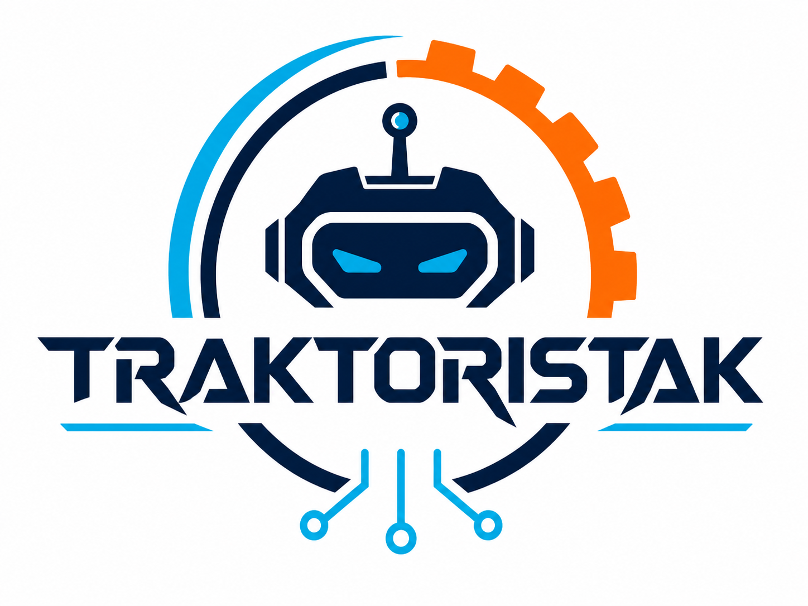
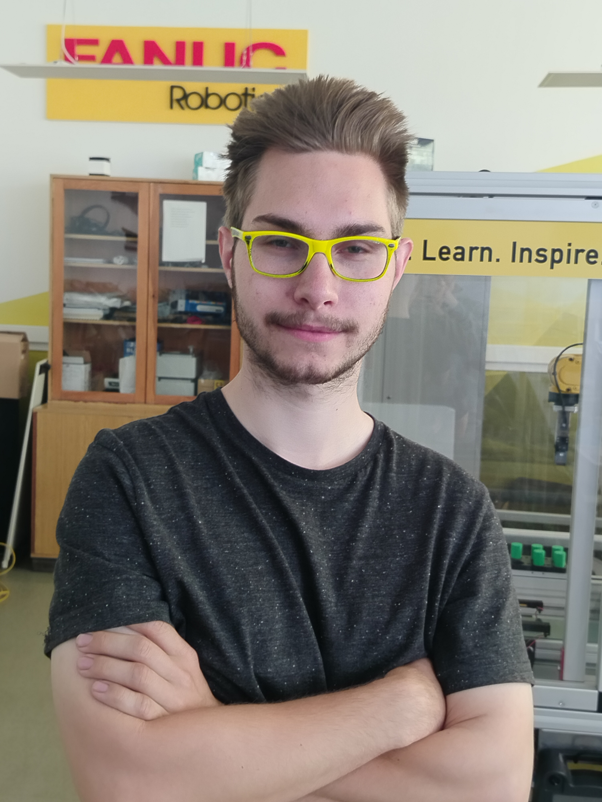

# WRO-FUTURE-ENGINEERS-2026 - TEAM TRAKTORISTAK

<p align="center">
  
</p>

> An autonomous vehicle designed for the Future Engineers category of the WRO 2026 that uses computer vision, distance sensing, and autonomous control software to navigate the track and avoid obstacles.

<a name="team-introduction--team-information"></a>
## Team Introduction & Team Information

<table>
  <tr>
    <td align="center" width="33%">
      <br>
      <strong>MARK GULYAS</strong><br>
      <em>Mechanical Design Support</em><br>
      <sub>Assistance, Part Development, Robot Assembly</sub>
    </td>
    <td align="center" width="33%">
      <br>
      <strong>RICHARD NAGY</strong><br>
      <em>Team Lead, Hardware and Software Developer</em><br>
      <sub>Robot Control, Hardware Integration, Software Architecture</sub>
    </td>
    <td align="center" width="33%">
      <br>
      <strong>PREDRAG PRIJOVIC</strong><br>
      <em>CAD Design Leader</em><br>
      <sub>CAD Design, Mechanical Engineering, Robot Assembly</sub>
    </td>
  </tr>
</table>

## Content Structure

* `t-photos` - Contains team member photos and can hold the official team photo and informal group pictures.
* `v-photos` - Includes vehicle images: top, bottom, front, back, left, and right.
* `video` - Holds `video.md` with a link to the driving demonstration.
* `schemes` - Contains the hardware repository with KiCad schematics, wiring references, component pictures, and generated schematic PDF.
* `src` - Full Python source code repository for all robot control components used in the competition.
* `models` - Contains the mechanical repository for robot design files and 3D-printable model assets.
* `other` - Contains supporting files, including resources used for this `README.md` and overall documentation.
* `obstacle challenge & open challenge` - Includes the complete codebase or references for both competition challenges.

---

## Table of Contents

- [Overview](#overview)
- [Team Introduction & Team Information](#team-introduction--team-information)
- [Content Structure](#content-structure)
- [Submodules & Repository Access](#submodules--repository-access)
- [Engineering Documentation](#engineering-documentation)
- [Cloning](#cloning)

---

<a name="overview"></a>
## Overview

This autonomous vehicle prototype was developed for the WRO Future Engineers 2026 competition. The robot uses a Raspberry Pi 3 as its main controller, with a regulated 5 V power system, ultrasonic distance sensors, IR reflectance sensors, a CSI camera, and an L298N motor driver for drivetrain and steering control. The software is written in Python and combines camera-based color detection, distance sensing, race-state logic, PID utilities, and modular hardware drivers to navigate the competition track and avoid obstacles. The project is organized into separate hardware, software, and mechanical areas so the full engineering process can be documented clearly from wiring and schematics to robot behavior and deployment.

<a name="submodules--repository-access"></a>
## Submodules & Repository Access

This repository uses Git submodules for the main engineering areas. The folders below are separate repositories connected to this main documentation repository:

- `schemes`: hardware documentation and schematics from [WRO-Robot-Hardware](https://github.com/Ricsi1231/WRO-Robot-Hardware)
- `src`: robot control source code from [WRO-Robot-Software](https://github.com/Ricsi1231/WRO-Robot-Software)
- `models`: mechanical design files from [WRO-Robot-Mechanical](https://github.com/Ricsi1231/WRO-Robot-Mechanical)

When opening the project on GitHub, users can enter these folders directly from this repository. If a folder looks empty after cloning locally, the submodules were not downloaded yet. Run:

```bash
git submodule update --init --recursive
```

For a fresh clone, use:

```bash
git clone --recurse-submodules https://github.com/Ricsi1231/WRO-Robot.git
```

<a name="engineering-documentation"></a>
## Engineering Documentation

- [Hardware documentation](https://github.com/Ricsi1231/WRO-Robot-Hardware/blob/dev/README.md): controller, power system, sensors, camera, motor driver, wiring, and schematic references.
- [Software documentation](https://github.com/Ricsi1231/WRO-Robot-Software/blob/dev/README.md): setup, robot runtime, deployment, calibration, component tests, architecture, and development workflow.
- [Architecture](https://github.com/Ricsi1231/WRO-Robot-Software/blob/dev/docs/architecture.md): software structure and runtime responsibilities.
- [Hardware and Configuration](https://github.com/Ricsi1231/WRO-Robot-Software/blob/dev/docs/hardware-and-config.md): pin configuration and hardware setup.
- [Deployment](https://github.com/Ricsi1231/WRO-Robot-Software/blob/dev/docs/deployment.md): Raspberry Pi deployment workflow.
- [Calibration](https://github.com/Ricsi1231/WRO-Robot-Software/blob/dev/docs/calibration.md): camera calibration process.
